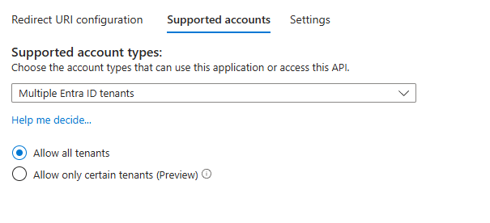
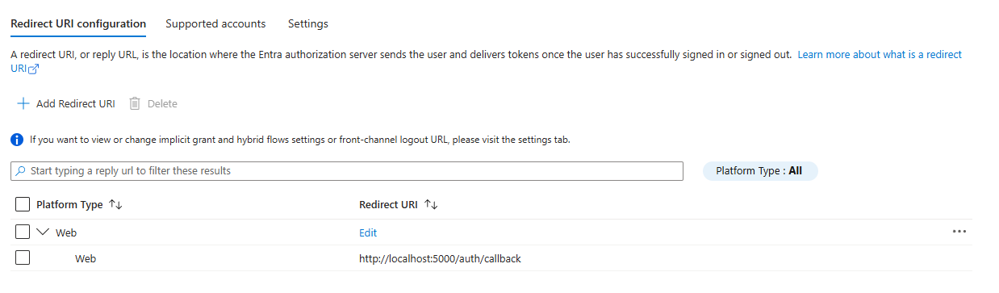
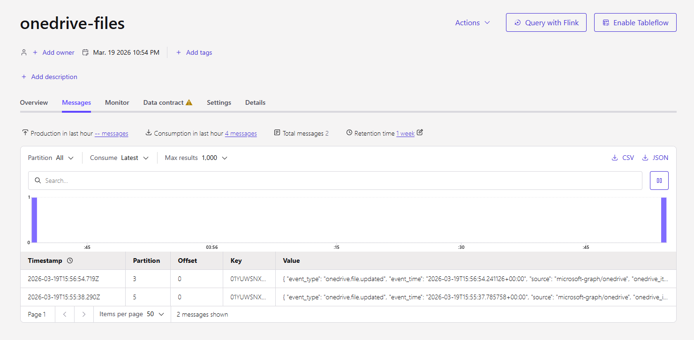

# OneDrive → Confluent Cloud (Microsoft Graph Microservice)

Flask microservice that listens for OneDrive file changes via Microsoft Graph webhooks and publishes events to a Confluent Cloud Kafka topic.

## How it works

```
Upload file to OneDrive
        ↓
Microsoft Graph detects change
        ↓
Graph sends POST → /onedrive/notifications (via Cloudflare Tunnel)
        ↓
Flask calls delta API to get changed items
        ↓
Fetches file metadata + content from Graph API
        ↓
Publishes JSON event to Confluent Cloud Kafka topic
```

> **Key constraint**: Microsoft Graph only accepts subscriptions on `/me/drive/root` (not subfolders) for personal OneDrive accounts.

---

## Prerequisites

- Python 3.13+
- Microsoft Azure app registration (free)
- Confluent Cloud Kafka cluster
- [cloudflared](https://developers.cloudflare.com/cloudflare-one/connections/connect-networks/downloads/) or [ngrok](https://ngrok.com/download) for a public webhook URL

---

## Setup

### 1. Azure App Registration

1. Go to [portal.azure.com](https://portal.azure.com) → **App registrations** → **New registration**
2. Supported account types: **Multiple Entra ID tenants**

3. Redirect URI (Web): `http://localhost:5000/auth/callback`

4. Under **Certificates & secrets** → create a **Client secret** — copy the value immediately
5. Note your **Application (client) ID** from the Overview page

### 2. Environment variables

```bash
cp .env.example .env
```

Edit `.env`:

```env
FLASK_SECRET_KEY=any-random-secret-string

# Azure (from App Registration)
AZURE_CLIENT_ID=your-app-client-id
AZURE_CLIENT_SECRET=your-app-client-secret
REDIRECT_URI=http://localhost:5000/auth/callback
AZURE_TENANT=common   # consumers | organizations | common | <tenant-id>

WATCH_RESOURCE=/me/drive/root

# Confluent Cloud (from Cluster Settings → Endpoints)
KAFKA_BOOTSTRAP=pkc-xxxxx.region.cloud.confluent.cloud:9092
KAFKA_API_KEY=your-kafka-api-key
KAFKA_API_SECRET=your-kafka-api-secret
KAFKA_TOPIC=onedrive-files
```

### 3. Install dependencies

```bash
pip install -r requirements.txt
```

> **Alternative (uv):** `uv sync`

---

## Usage

### Step 1 — Start the app

```bash
python main.py
```

> **Alternative (uv):** `uv run python main.py`

The API will be available at `http://localhost:5000`. Swagger UI: `http://localhost:5000/apidocs`

---

### Step 2 — Authenticate

Open in a browser (Microsoft login requires a browser — cannot use curl):

```
http://localhost:5000/auth/login
```

Sign in with your Microsoft account and approve the permissions. On success you'll see:

```json
{"message": "authenticated", "expires_in": 3600}
```

Tokens are saved to `tokens.json` so the webhook handler keeps working even after your browser session ends.

---

### Step 3 — Expose webhook via tunnel

Microsoft Graph requires a **public HTTPS URL** to send notifications to. Your `localhost:5000` is not reachable from the internet, so you need a tunnel.

#### Option A — Cloudflare Tunnel

**Quick (no account needed — URL changes on each restart):**

```bash
cloudflared tunnel --url http://localhost:5000
```

Note the URL printed, e.g. `https://random-words.trycloudflare.com`

**Named tunnel (stable URL, requires Cloudflare account):**

```bash
cloudflared tunnel login
cloudflared tunnel create onedrive-poc
cloudflared tunnel route dns onedrive-poc webhook.yourdomain.com
cloudflared tunnel run --url http://localhost:5000 onedrive-poc
```

#### Option B — ngrok

**Quick (free account — URL changes on each restart):**

```bash
ngrok http 5000
```

Note the URL printed, e.g. `https://abcd-1234.ngrok-free.app`

**Static domain (stable URL, requires ngrok paid plan or free static domain):**

```bash
ngrok http --domain=your-static-domain.ngrok-free.app 5000
```

---

### Step 4 — Create a Graph subscription

Replace the `notification_url` with your tunnel URL (Cloudflare or ngrok).

```bash
curl -X POST http://localhost:5000/subscriptions \
  -H "Content-Type: application/json" \
  -d '{
    "notification_url": "https://<your-tunnel-url>/onedrive/notifications",
    "resource": "/me/drive/root",
    "change_types": "updated",
    "expiration_hours": 4
  }'
```

> **Note**: `resource` must be `/me/drive/root` — Microsoft Graph rejects folder-level subscriptions for personal OneDrive accounts.
>
> **Note**: `change_types` must be `updated` — Graph only accepts `updated` for drive subscriptions. The `updated` event covers file created, modified, and deleted changes.

Or use the Swagger UI at `http://localhost:5000/apidocs`.

---

### Step 5 — Upload a file to OneDrive

Upload or modify a file in your watched OneDrive folder. The service will automatically:

1. Receive a Graph notification at `/onedrive/notifications`
2. Call the delta API to discover what changed
3. Fetch file metadata (and content if < 5 MB)
4. Publish a JSON event to your Kafka topic

**Example Kafka event** (from the `onedrive-files` topic):

```json
{
  "event_type": "onedrive.file.updated",
  "event_time": "2026-03-19T15:56:54.241126+00:00",
  "source": "microsoft-graph/onedrive",
  "onedrive_item_id": "01YUWSNX...",
  "name": "report.xlsx",
  "mime_type": "application/vnd.openxmlformats-officedocument.spreadsheetml.sheet",
  "size_bytes": 45231,
  "web_url": "https://onedrive.live.com/...",
  "drive_id": "b!abcdef...",
  "folder_path": "/drive/root",
  "created_at": "2026-03-19T15:56:54Z",
  "last_modified_at": "2026-03-19T15:56:54Z",
  "modified_by_name": "John Doe",
  "modified_by_email": "john@example.com",
  "modified_by_id": "user-guid",
  "content_base64": "..."
}
```

> Files ≥ 5 MB: `content_base64` is omitted, `download_url` is included instead.



---

## Subscription management

Subscriptions expire (max ~4230 hours for OneDrive). Check expiry and renew before it lapses:

**List active subscriptions:**

```bash
curl http://localhost:5000/subscriptions
```

**Renew a subscription:**

```bash
curl -X POST http://localhost:5000/subscriptions/<sub_id>/renew \
  -H "Content-Type: application/json" \
  -d '{"expiration_hours": 4}'
```

**Delete a subscription:**

```bash
curl -X DELETE http://localhost:5000/subscriptions/<sub_id>
```

---

## API Reference

Swagger UI: `http://localhost:5000/apidocs`

| Method | Path | Description |
|--------|------|-------------|
| `GET` | `/auth/login` | Redirect to Microsoft login |
| `GET` | `/auth/callback` | OAuth2 callback (handled automatically) |
| `GET` | `/auth/logout` | Clear session and sign out |
| `GET` | `/me` | Current user profile |
| `GET` | `/files` | List OneDrive root contents |
| `GET` | `/files/<id>` | List folder children |
| `GET` | `/files/<id>/info` | File or folder metadata |
| `GET` | `/files/<id>/download-url` | Get short-lived download URL |
| `GET` | `/search?q=<query>` | Search files by name |
| `POST` | `/subscriptions` | Create Graph change subscription |
| `GET` | `/subscriptions` | List active subscriptions |
| `DELETE` | `/subscriptions/<id>` | Delete a subscription |
| `POST` | `/subscriptions/<id>/renew` | Renew subscription before expiry |
| `GET/POST` | `/onedrive/notifications` | Webhook endpoint (called by Microsoft Graph) |

---

## Notes

- `tokens.json` is created after login — keep it secret, it contains your OAuth tokens
- `delta_token.json` is created on first webhook notification — tracks the delta cursor so only new changes are returned on subsequent calls
- Delegated permissions are used (the app acts on behalf of the logged-in user)
- Personal Microsoft accounts and business (Entra ID) accounts are both supported via `AZURE_TENANT=common`
- The app must be running and the tunnel active for notifications to reach it
